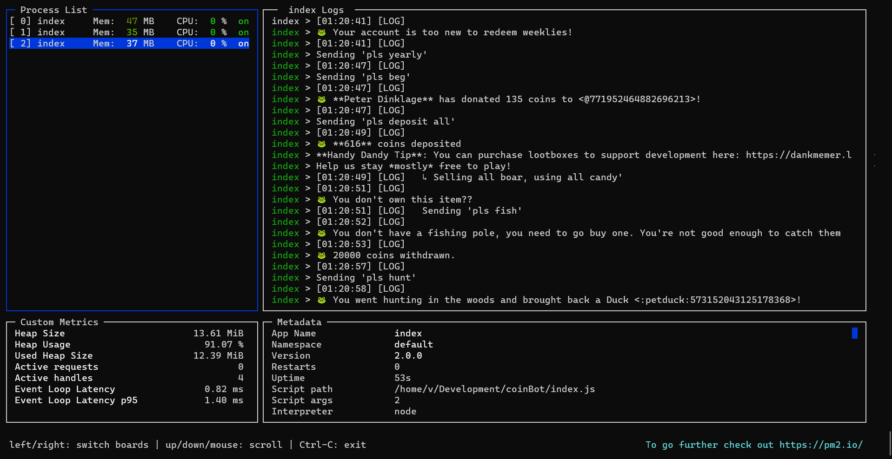

# dankBot

A script to [farm fake coins on the internet](http://dankmemer.lol/); forked from [this](https://github.com/spaceface777/DankMemerBotBot).

### Features

-   [`concurrency`](https://www.npmjs.com/package/concurrently) for active
    horizontal scaling
-   [`PM2`](https://pm2.keymetrics.io/) for even fancier background
    management
-   Argument toggling via `-- <profile>` for faster smurfing
-   ++ `pls hunt`, `pls fish`, `pls sell`, `pls use` `pls trivia`, `Type ...` optimizations, with possibly more later idk

### Disclaimer(s)

-   Using a user account as a bot is technically against Discord's ToS
-   This is for educational purposes / jokes only; if you get banned from
    anything, I told you so
-   Have gotten a few accounts justifiably blacklisted for throttling while testing, so yeah; go easy.
-   I did not make this bot, go give [the creator some love](https://github.com/spaceface777/DankMemerBotBot)

### Donate

If you're having fun, donate to the [Dank Memer
team](https://www.patreon.com/dankmemerbot) for a cool bot.

### Usage

1.  Make a copy of `config.example.json` into `config.json`
2.  Edit `config.json` and put in your account's [Discord token](https://github.com/Tyrrrz/DiscordChatExporter/wiki/Obtaining-Token-and-Channel-IDs#how-to-get-a-user-token)
3.  Edit any other config params you wish to change in `index.js` or `package.json`, such as timeouts or profile
4.  Run the script: `$ npm start`, or the parallel version with `\$ npm run prod`
5.  Go to the Discord channel where you want your bot to work and try `$start` (or `$s`)
6.  ???
7.  Profit

